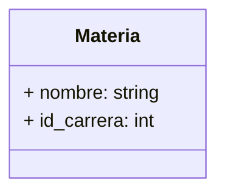
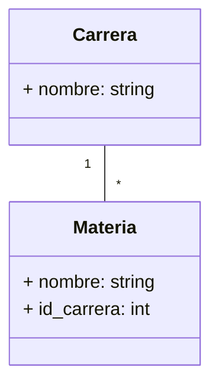
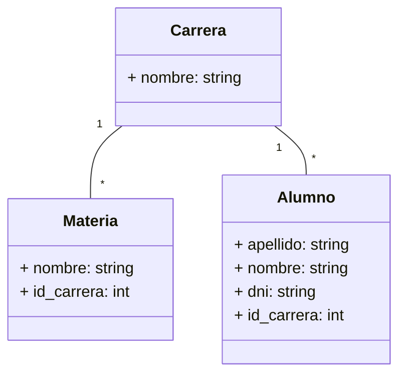

# UNaHur - Estrategias de persistencia

## Primera Iteración

Para esta primera instancia del trabajo práctico, se realiza una entidad llamada `materia` que va a contener las diferentes materias que tiene una carrera.

La tabla tendrá los siguientes campos:



Para lograr esto vamos a hacer uso de modulo `sequelize-cli` mediante el cual le vamos a indicar el nombre de la entidad y sus campos (con sus tipos):

```console
npx sequelize-cli model:generate --name materia --attributes nombre:string,id_carrera:integer
```

Este comando generará dos archivos por un lado `materia.js` en la carpeta `api/models/` que define en objeto modelo materia para utilizar en la aplicación y `[datetimestamp]-create-materia.js` en la carpeta `api/migrations/` que mediante el siguiente comando impactará el modelo propuesto en la base de datos de la aplicación.

```console
npx sequelize db:migrate
```

Una vez realizada la actualización de la base de datos, se deberá adicionar las rutas necesarias en la API para poder acceder a los distintos métodos para la entidad `materia`. Para lograr este objetivo se debe generar un nuevo archivo `materias.js` dentro de `api/routes`, casi con la misma estructura que brinda el archivo `carreras.js` en la misma ubicación.

```javascript
var express = require("express");
var router = express.Router();
var models = require("../models");

router.get("/", (req, res) => {
  models.materia
    .findAll({
      attributes: ["id", "nombre", "id_carrera"],
    })
    .then((materias) => res.send(materias))
    .catch(() => res.sendStatus(500));
});

router.post("/", (req, res) => {
  models.materia
    .create({
      nombre: req.body.nombre,
      id_carrera: req.body.id_carrera,
    })
    .then((materia) => res.status(201).send({ id: materia.id }))
    .catch((error) => {
      if (error == "SequelizeUniqueConstraintError: Validation error") {
        res.status(400).send("Bad request: existe otra materia con el mismo nombre");
      } else {
        console.log(`Error al intentar insertar en la base de datos: ${error}`);
        res.sendStatus(500);
      }
    });
});

const findMateria = (id, { onSuccess, onNotFound, onError }) => {
  models.materia
    .findOne({
      attributes: ["id", "nombre", "id_carrera"],
      where: { id },
    })
    .then((materia) => (materia ? onSuccess(materia) : onNotFound()))
    .catch(() => onError());
};

router.get("/:id", (req, res) => {
  findMateria(req.params.id, {
    onSuccess: (materia) => res.send(materia),
    onNotFound: () => res.sendStatus(404),
    onError: () => res.sendStatus(500),
  });
});

router.put("/:id", (req, res) => {
  const onSuccess = (materia) =>
    materia
      .update(
        {
          nombre: req.body.nombre,
          id_carrera: req.body.id_carrera,
        },
        { fields: ["nombre", "id_carrera"] }
      )
      .then(() => res.sendStatus(200))
      .catch((error) => {
        if (error == "SequelizeUniqueConstraintError: Validation error") {
          res.status(400).send("Bad request: existe otra materia con el mismo nombre");
        } else {
          console.log(`Error al intentar actualizar la base de datos: ${error}`);
          res.sendStatus(500);
        }
      });
  findMateria(req.params.id, {
    onSuccess,
    onNotFound: () => res.sendStatus(404),
    onError: () => res.sendStatus(500),
  });
});

router.delete("/:id", (req, res) => {
  const onSuccess = (materia) =>
    materia
      .destroy()
      .then(() => res.sendStatus(200))
      .catch(() => res.sendStatus(500));
  findMateria(req.params.id, {
    onSuccess,
    onNotFound: () => res.sendStatus(404),
    onError: () => res.sendStatus(500),
  });
});

module.exports = router;
```

Una vez agregado el contenido en el archivo se debe reiniciar la aplicación y verificar el comportamiento de los distintos endpoints que se agregaron.

## Segunda Iteración

Durante esta segunda iteración de código se realizará una asociación entre dos tablas

El siguiente ejemplo muestra la entidad/tabla `materia` asociada a la entidad/tabla `carrera`, donde muchas materias puedes estar relacionadas a una sola Carrera:



Editando cualquiera de los archivos que definen alguna de las dos entidades relacionadas, se puede definir la relación, en este caso se optó por definir la relación en `materias.js` ubicado en `api/models/` mediante el método `associate`

```javascript
"use strict";
module.exports = (sequelize, DataTypes) => {
  const materia = sequelize.define(
    "materia",
    {
      nombre: DataTypes.STRING,
      id_carrera: DataTypes.INTEGER,
    },
    {}
  );
  materia.associate = function (models) {
    // modelo al que pertenece
    materia.belongsTo(models.carrera, {
      // nombre de mi relacion
      as: "Carrera-Relacionada",
      // campo con el que voy a igualar
      foreignKey: "id_carrera",
    });
  };
  return materia;
};
```

Por otro lado se modifican los routes correspondientes para dejar de manifiesto la relación recientemente creada, en este caso en `materia.js` en `api/routes/` se modifica el método `get`

```javascript
router.get("/", (req, res, next) => {
  models.materia
    .findAll({
      attributes: ["id", "nombre", "id_carrera"],
      // se agrega la asociacion
      include: [{ as: "Carrera-Relacionada", model: models.carrera, attributes: ["id", "nombre"] }],
    })
    .then((materias) => res.send(materias))
    .catch((error) => {
      return next(error);
    });
});
```

De la misma manera se deberán adapatar los demás métodos para poner de manifiesto dicha relación.

Continuando con el ejemplo y verificando su funcionamiento, se prosigue a la implementación de la entidad `alumnos` y su relacion con la entidad `carrera`, teniendo por objetivo obtener el siguiente diagrama:



Para lograr esto vamos a hacer uso de modulo `sequelize-cli` mediante el cual le vamos a indicar el nombre de la entidad y sus campos (con sus tipos):

```console
npx sequelize-cli model:generate --name alumno --attributes nombre:string,apellido:string,dni:string,id_carrera:integer
```

Este comando generará dos archivos por un lado `alumno.js` en la carpeta `api/models/` que define en objeto modelo materia para utilizar en la aplicación y `[datetimestamp]-create-alumno.js` en la carpeta `api/migrations/` que mediante el siguiente comando impactará el modelo propuesto en la base de datos de la aplicación.

```console
npx sequelize db:migrate
```

Una vez realizada la actualización de la base de datos, se deberá adicionar las rutas necesarias en la API para poder acceder a los distintos métodos para la entidad `alumno`. Para lograr este objetivo se debe generar un nuevo archivo `alumnos.js` dentro de `api/routes`, casi con la misma estructura que brinda el archivo `materias.js` en la misma ubicación.

## TEST

Para poder realizar test en la API, se debe instalar los paquetes que corresponden a dicha tarea.

```console
npm i jest --save-dev
```

```console
npm i supertest --save-dev
```

Se edita el `package.json` y se agrega:

```json
    "scripts": {
        "test": "jest"
    }
```

Se edita `config.json` y se agrega:

```json
  "test": {
    "username": "root",
    "password": "root",
    "database": "api_v1_test",
    "host": "localhost",
    "dialect": "mariadb",
    "operatorsAliases": 0
  }
```

Se debe realizar la migracion de los modelos a la base de datos determinada para pruebas:

```console
npx sequelize db:migrate --env test
```

Se crea la carpeta test, en la que se crearán el o los archivos con los test de cada una de las rutas de la api, por ejemplo `routes.test.js`.

Para lanzar todos los test se ejecuta

```console
npm test
```
