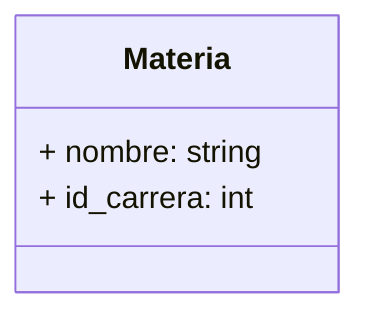
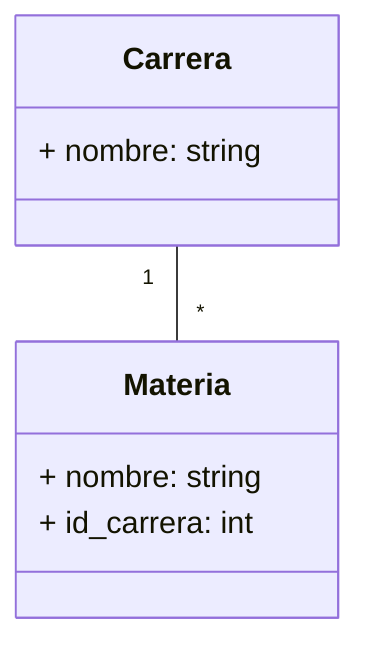
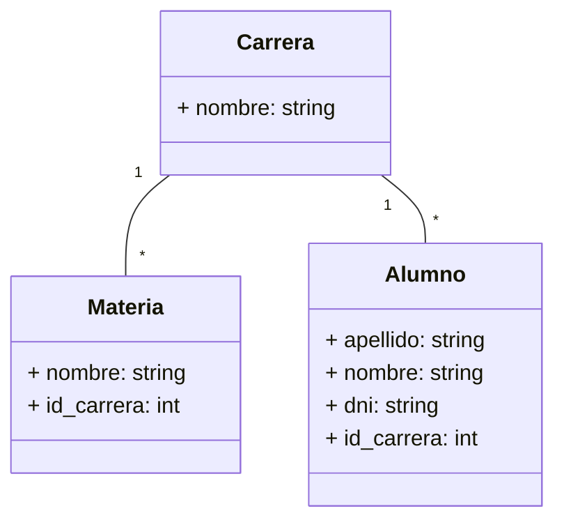
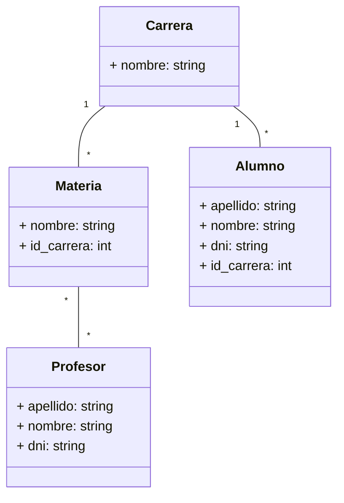
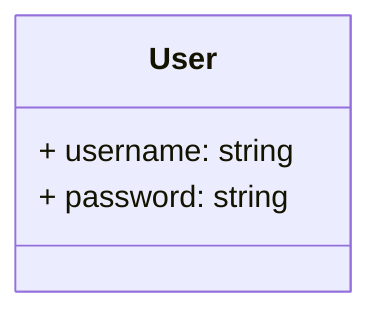

# UNaHur - Estrategias de persistencia

## Primera Iteración

Para esta primera instancia del trabajo práctico, se realiza una entidad llamada `materia` que va a contener las diferentes materias que tiene una carrera.

La tabla tendrá los siguientes campos:



Para lograr esto vamos a hacer uso de modulo `sequelize-cli` mediante el cual le vamos a indicar el nombre de la entidad y sus campos (con sus tipos):

```console
npx sequelize-cli model:generate --name materia --attributes nombre:string,id_carrera:integer
```

Este comando generará dos archivos por un lado `materia.js` en la carpeta `api/models/` que define en objeto modelo materia para utilizar en la aplicación y `[datetimestamp]-create-materia.js` en la carpeta `api/migrations/` que mediante el siguiente comando impactará el modelo propuesto en la base de datos de la aplicación.

```console
npx sequelize db:migrate
```

Una vez realizada la actualización de la base de datos, se deberá adicionar las rutas necesarias en la API para poder acceder a los distintos métodos para la entidad `materia`. Para lograr este objetivo se debe generar un nuevo archivo `materias.js` dentro de `api/routes`, casi con la misma estructura que brinda el archivo `carreras.js` en la misma ubicación.

```javascript
var express = require('express');
var router = express.Router();
var models = require('../models');

router.get('/', (req, res) => {
  models.materia
    .findAll({
      attributes: ['id', 'nombre', 'id_carrera'],
    })
    .then((materias) => res.send(materias))
    .catch(() => res.sendStatus(500));
});

router.post('/', (req, res) => {
  models.materia
    .create({
      nombre: req.body.nombre,
      id_carrera: req.body.id_carrera,
    })
    .then((materia) => res.status(201).send({ id: materia.id }))
    .catch((error) => {
      if (error == 'SequelizeUniqueConstraintError: Validation error') {
        res.status(400).send('Bad request: existe otra materia con el mismo nombre');
      } else {
        console.log(`Error al intentar insertar en la base de datos: ${error}`);
        res.sendStatus(500);
      }
    });
});

const findMateria = (id, { onSuccess, onNotFound, onError }) => {
  models.materia
    .findOne({
      attributes: ['id', 'nombre', 'id_carrera'],
      where: { id },
    })
    .then((materia) => (materia ? onSuccess(materia) : onNotFound()))
    .catch(() => onError());
};

router.get('/:id', (req, res) => {
  findMateria(req.params.id, {
    onSuccess: (materia) => res.send(materia),
    onNotFound: () => res.sendStatus(404),
    onError: () => res.sendStatus(500),
  });
});

router.put('/:id', (req, res) => {
  const onSuccess = (materia) =>
    materia
      .update(
        {
          nombre: req.body.nombre,
          id_carrera: req.body.id_carrera,
        },
        { fields: ['nombre', 'id_carrera'] }
      )
      .then(() => res.sendStatus(200))
      .catch((error) => {
        if (error == 'SequelizeUniqueConstraintError: Validation error') {
          res.status(400).send('Bad request: existe otra materia con el mismo nombre');
        } else {
          console.log(`Error al intentar actualizar la base de datos: ${error}`);
          res.sendStatus(500);
        }
      });
  findMateria(req.params.id, {
    onSuccess,
    onNotFound: () => res.sendStatus(404),
    onError: () => res.sendStatus(500),
  });
});

router.delete('/:id', (req, res) => {
  const onSuccess = (materia) =>
    materia
      .destroy()
      .then(() => res.sendStatus(200))
      .catch(() => res.sendStatus(500));
  findMateria(req.params.id, {
    onSuccess,
    onNotFound: () => res.sendStatus(404),
    onError: () => res.sendStatus(500),
  });
});

module.exports = router;
```

Una vez agregado el contenido en el archivo se debe reiniciar la aplicación y verificar el comportamiento de los distintos endpoints que se agregaron.

## Segunda Iteración

Durante esta segunda iteración de código se realizará una asociación entre dos tablas

El siguiente ejemplo muestra la entidad/tabla `materia` asociada a la entidad/tabla `carrera`, donde muchas materias puedes estar relacionadas a una sola Carrera:



Editando cualquiera de los archivos que definen alguna de las dos entidades relacionadas, se puede definir la relación, en este caso se optó por definir la relación en `materias.js` ubicado en `api/models/` mediante el método `associate`

```javascript
'use strict';
module.exports = (sequelize, DataTypes) => {
  const materia = sequelize.define(
    'materia',
    {
      nombre: DataTypes.STRING,
      id_carrera: DataTypes.INTEGER,
    },
    {}
  );
  materia.associate = function (models) {
    // modelo al que pertenece
    materia.belongsTo(models.carrera, {
      // nombre de mi relacion
      as: 'Carrera-Relacionada',
      // campo con el que voy a igualar
      foreignKey: 'id_carrera',
    });
  };
  return materia;
};
```

Por otro lado se modifican los routes correspondientes para dejar de manifiesto la relación recientemente creada, en este caso en `materia.js` en `api/routes/` se modifica el método `get`

```javascript
router.get('/', (req, res, next) => {
  models.materia
    .findAll({
      attributes: ['id', 'nombre', 'id_carrera'],
      // se agrega la asociacion
      include: [{ as: 'Carrera-Relacionada', model: models.carrera, attributes: ['id', 'nombre'] }],
    })
    .then((materias) => res.send(materias))
    .catch((error) => {
      return next(error);
    });
});
```

De la misma manera se deberán adaptar los demás métodos para poner de manifiesto dicha relación.

Continuando con el ejemplo y verificando su funcionamiento, se prosigue a la implementación de la entidad `alumnos` y su relación con la entidad `carrera`, teniendo por objetivo obtener el siguiente diagrama:



Para lograr esto vamos a hacer uso de modulo `sequelize-cli` mediante el cual le vamos a indicar el nombre de la entidad y sus campos (con sus tipos):

```console
npx sequelize-cli model:generate --name alumno --attributes nombre:string,apellido:string,dni:string,id_carrera:integer
```

Este comando generará dos archivos por un lado `alumno.js` en la carpeta `api/models/` que define en objeto modelo materia para utilizar en la aplicación y `[datetimestamp]-create-alumno.js` en la carpeta `api/migrations/` que mediante el siguiente comando impactará el modelo propuesto en la base de datos de la aplicación.

```console
npx sequelize db:migrate
```

Una vez realizada la actualización de la base de datos, se deberá adicionar las rutas necesarias en la API para poder acceder a los distintos métodos para la entidad `alumno`. Para lograr este objetivo se debe generar un nuevo archivo `alumnos.js` dentro de `api/routes`, casi con la misma estructura que brinda el archivo `materias.js` en la misma ubicación.

Continuamos agregando funcionalidad, por lo que ahora implementamos de la entidad `profesor` y su relación con la entidad `materia`, teniendo por objetivo obtener el siguiente diagrama:



Para lograr esto, vamos a hacer uso del módulo `sequelize-cli` mediante el cual le vamos a indicar el nombre de la entidad y sus campos (con sus tipos):

```console
npx sequelize-cli model:generate --name profesor --attributes apellido:string,nombre:string,dni:integer
```

Este comando generará dos archivos por un lado `profesor.js` en la carpeta `api/models/` que define en objeto modelo profesor para utilizar en la aplicación y `[datetimestamp]-create-profesor.js` en la carpeta `api/migrations/` que mediante el siguiente comando impactará el modelo propuesto en la base de datos de la aplicación.

```console
npx sequelize db:migrate
```

Antes de realizar la migración, para que en la base de datos no se genere una tabla con el nombre "profesors",
indico en models/profesor.js, que el nombre de la tabla, será `profesores`, de la siguiente manera:

```javascript
'use strict';
module.exports = (sequelize, DataTypes) => {
  const profesor = sequelize.define(
    'profesor',
    {
      apellido: DataTypes.STRING,
      nombre: DataTypes.STRING,
      dni: DataTypes.INTEGER,
    },
    { tableName: 'profesores' }
  );
  return profesor;
};
```

Hecho esto, en `api/migrations/[datetimestamp]-create-profesor.js`, voy a hacer referencia a dicha tabla
como `profesores`:

```javascript
return queryInterface.createTable('profesores',...
return queryInterface.dropTable('profesores');
```

Una vez realizada la actualización de la base de datos, se deberá adicionar las rutas necesarias en la API para poder acceder a los distintos métodos para la entidad `profesor`. Para lograr este objetivo se debe generar un nuevo archivo `profesor.js` dentro de `api/routes`.

Este archivo, inicialmente tendrá un método get, para poder comprobar su funcionamiento:

```javascript
var express = require('express');
var router = express.Router();
var models = require('../models');

router.get('/', (req, res, next) => {
  models.profesor
    .findAll({
      attributes: ['id', 'apellido', 'nombre', 'dni'],
    })
    .then((profesores) => res.send(profesores))
    .catch((error) => {
      return next(error);
    });
});

module.exports = router;
```

En archivo `app.js` se agrega router profesores, con las siguientes líneas:

```javascript
var profesoresRouter = require('./routes/profesores');
app.use('/prof', profesoresRouter);
```

Dado que la asociación entre los modelos materia y profesor, es del tipo M:N, se debe realizar un modelo intermedio entre ambos. Para ello crearemos y migraremos el modelo `profesor_materia` mediante la línea de comandos.

```console
npx sequelize-cli model:generate --name profesor_materia --attributes id_profesor:integer,id_materia:integer
npx sequelize db:migrate
```

En este punto, es necesario asociar, los modelos de `profesor` y `materia`, con el modelo recién creado.
Esta asociación la realizaremos con `hasMany`:

En `models/profesor.js`

```javascript
profesor.hasMany(models.profesor_materia, {
  as: 'Materia-Relacionada',
  foreignKey: 'id_profesor',
});
```

En `models/materia.js`

```javascript
materia.hasMany(models.profesor_materia, {
  as: 'Profesor-Relacionado',
  foreignKey: 'id_materia',
});
```

También se debe asociar el modelo `profesor_materia` a los modelos `profesor` y `materia`.
Esta asociación la realizaremos con `belongsTo`:

En `models/profesor_materia.js`

```javascript
profesor_materia.associate = function (models) {
  // associations can be defined here
  profesor_materia.belongsTo(models.profesor, {
    as: 'Profesor',
    foreignKey: 'id_profesor',
  }),
    profesor_materia.belongsTo(models.materia, {
      as: 'Materia',
      foreignKey: 'id_materia',
    });
};
```

En el controlador de materia en `routes/materias.js`, dentro del método get agrego esta asociación, que consiste en un include para realizar la asociación con la tabla intermedia `profesor_materia`, y dentro otro include para la asociación con `profesor`.
`Materia` ya tenía una asociación previa con el modelo `carrera`.

```javascript
router.get('/', (req, res, next) => {
  models.materia
    .findAll({
      attributes: ['id', 'nombre', 'id_carrera'],

      include: [
        {
          as: 'Carrera-Relacionada',
          model: models.carrera,
          attributes: ['nombre'],
        },
        {
          as: 'Profesor-Relacionado',
          model: models.profesor_materia,
          attributes: ['id_profesor'],
          include: [
            {
              as: 'Profesor',
              model: models.profesor,
              attributes: ['apellido', 'nombre', 'dni'],
            },
          ],
        },
      ],
    })
    .then((materias) => res.send(materias))
    .catch((error) => {
      return next(error);
    });
});
```

Análogamente, realizaremos el mismo procedimiento para el controlador de `profesor`. En el método get agrego la asociación, con un include para realizar la asociación con la tabla intermedia `profesor_materia`, y dentro otro include para realizar la asociación con `materia`.

```javascript
router.get('/', (req, res, next) => {
  models.profesor
    .findAll({
      attributes: ['id', 'apellido', 'nombre', 'dni'],

      include: [
        {
          as: 'Materia-Relacionada',
          model: models.profesor_materia,
          attributes: ['id_materia'],
          include: [
            {
              as: 'Materia',
              model: models.materia,
              attributes: ['nombre'],
            },
          ],
        },
      ],
    })
    .then((profesores) => res.send(profesores))
    .catch((error) => {
      return next(error);
    });
});
```

## JSON Web Token

### Usuarios

Para poder hacer uso del JWT en la autenticación de las solicitudes en la API, se deberá crear una nueva entidad `User` para poder administrar el acceso a la generación de los token autentificadores.



Para esto utilizando el `sequelize-cli` vamor a generar la entidad con sus respectivos campos. Y realizar la respectiva migración que impacte en la base de datos.

```console
npx sequelize-cli model:generate --name user --attributes username:string,password:string

npx sequelize db:migrate
```

### Seguridad en el password

Para contar con un grado adicional de seguridad se deberá mediante el módulo `bcrypt`, más especificamente con el método `hash` encriptar la cadena password que almacenemos en la entidad `User` para así quedar resguardada de posibles accesos no autorizados a la misma desde la base de datos.

Por otro lado para poder almacenar `SALT_GEN` la cual se utilizará el método de `hash` se hará uso del módulo `dotenv` que brinda el acceso a distintas variables almacenadas en un archivo especial denominado `.env`.

```console
 npm i bcrypt jsonwebtoken
 npm i --save-dev dotenv
```

```javascript
// Generar el password encriptado
const hashedPassword = await bcrypt.hash(req.body.password, process.env.SALT_GEN);

// Comparar el password enviado con el almacenado en la base de datos.
bcrypt.compare(req.body.password, user.password);
```

Para la entidad `User` se contará con dos métodos `POST` en diferentes endpoints `/user` y `/login`, en el primero se creará el usuario con su nombre y contraseña y con el segundo mediante la autenticación del mimos se generará el token correspondienta para el acceso a los demas recusos de la API, como se describe en el siguiente esquema:

```mermaid
sequenceDiagram
  autonumber
  participant Browser
  participant Server
rect rgb(80, 65, 55)
  Browser ->>  Server: HTTP POST hostname/user
  Browser ->> +Server: HTTP POST hostname/login
  Server -->> -Browser: accessToken
end
loop
  Browser ->>  +Server: HTTP REQUEST [header Bearer accessToken]
  Server -->> -Browser: HTTP RESPONSE
alt TOKEN_TIMEOUT
  Browser ->> +Server: HTTP POST hostname/refreshToken
  Server -->> -Browser: accessToken
end
end

  Browser ->> +Server: HTTP DELETE hostname/logout
```



Cabe señalar que adicionalmente al token de acceso se generará un token de refresco que se utilizará cuando expirado el tiempo de vida del token principal se deberá realizar una solicitud `POST` al endpoint `/refreshToken` con el objetivo de generar un nuevo token de acceso que permita seguir accediendo a los recursos de la API, de esta manera se evita tener token generados que puedan seguir accediendo indefinidamente a los recursos, generando otro problema de seguridad al respecto.

## TEST

Para poder realizar test en la API, se debe instalar los paquetes que corresponden a dicha tarea.

```console
npm i jest --save-dev
```

```console
npm i supertest --save-dev
```

Se edita el `package.json` y se agrega:

```json
    "scripts": {
        "test": "jest"
    }
```

Se edita `config.json` y se agrega:

```json
  "test": {
    "username": "root",
    "password": "root",
    "database": "api_v1_test",
    "host": "localhost",
    "dialect": "mariadb",
    "operatorsAliases": 0
  }
```

Se debe realizar la migracion de los modelos a la base de datos determinada para pruebas:

```console
npx sequelize db:migrate --env test
```

Se crea la carpeta test, en la que se crearán el o los archivos con los test de cada una de las rutas de la api, por ejemplo `routes.test.js`.

Para lanzar todos los test se ejecuta

```console
npm test
```
